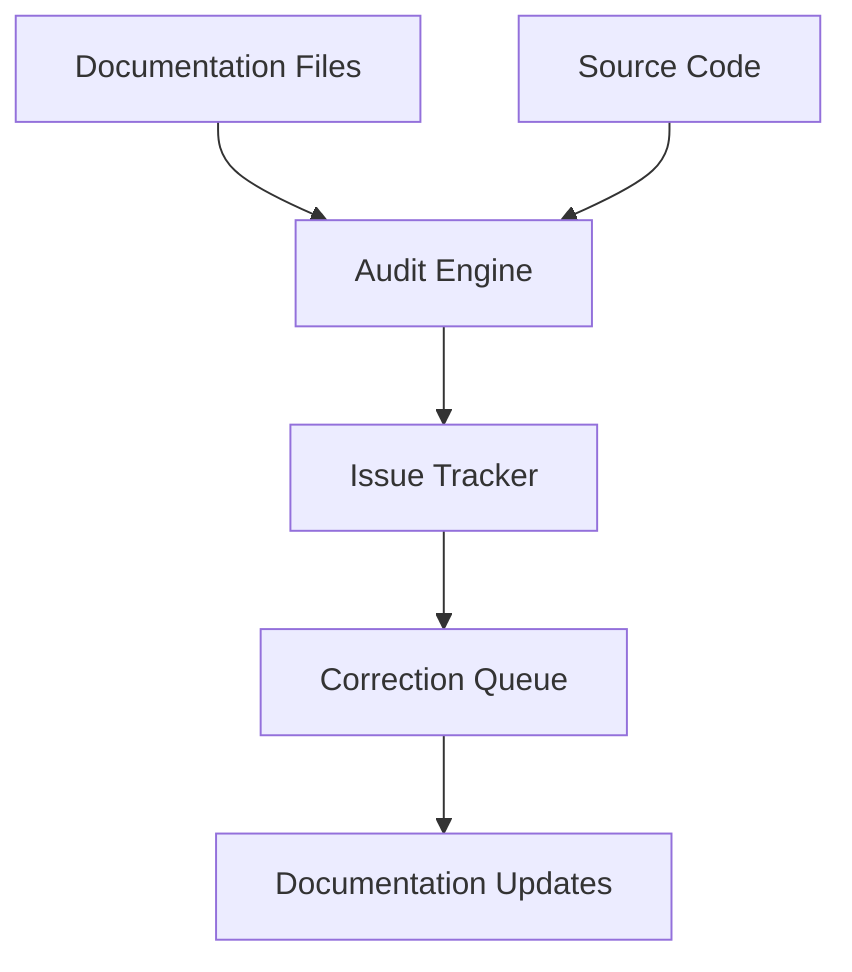
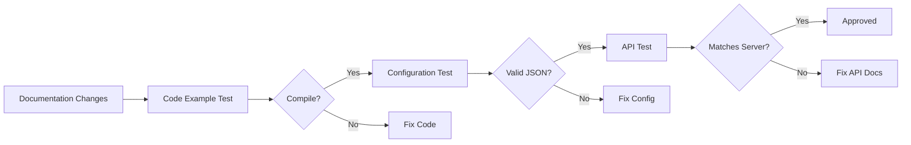

# OmniAgent Documentation Fix Design

## Overview

This design outlines the systematic approach to fixing documentation errors and inconsistencies across the OmniAgent project. The solution involves auditing existing documentation, creating a unified documentation standard, and implementing corrections based on actual code implementation.

## Architecture

The documentation fix process follows a three-tier architecture:

1. **Audit Layer**: Systematic review of all documentation files against actual code
2. **Standardization Layer**: Establishment of consistent naming and formatting standards
3. **Implementation Layer**: Application of corrections with validation

## Components and Interfaces

### 1. Documentation Audit System



**Components**:
- **File Scanner**: Identifies all documentation files (.md, .json, .txt)
- **Code Extractor**: Pulls actual API signatures and configuration structures
- **Validator**: Compares documentation against actual implementation
- **Issue Logger**: Records discrepancies with line numbers and severity

### 2. Standardization Framework

**Naming Conventions**:
- Project name: "OmniAgent" (title case for headings), "omni-agent" (kebab-case for code)
- Configuration fields: Exact match to struct field names
- API endpoints: Match actual Axum router paths
- Code examples: Use consistent formatting and syntax highlighting

**Configuration Standards**:
- MCP: Use standard MCP format with `mcpServers` root key
- A2A: Use HashMap<String, A2AServerConfig> structure
- Environment variables: Match actual override_with_env() implementation
- Defaults: Align with AppConfig Default trait

### 3. Validation System

**Code Example Validation**:
- Compile-time checking using Rust playground integration
- Runtime validation with mock data
- Integration testing with actual endpoints
- Dependency version verification

**Configuration Validation**:
- JSON schema validation against AppConfig
- Required field verification
- Type checking for all configuration values
- Environment variable override testing

## Data Models

### Documentation Structure

```rust
struct DocumentationFile {
    path: String,
    file_type: DocumentationType,
    sections: Vec<DocumentationSection>,
    issues: Vec<Issue>,
}

enum DocumentationType {
    Readme,
    ConfigurationExample,
    APIReference,
    UsageGuide,
    Architecture,
}

struct DocumentationSection {
    title: String,
    content: String,
    code_blocks: Vec<CodeBlock>,
    line_range: (usize, usize),
}

struct CodeBlock {
    language: String,
    content: String,
    is_valid: bool,
    validation_errors: Vec<String>,
}

struct Issue {
    severity: IssueSeverity,
    category: IssueCategory,
    description: String,
    location: (String, usize),
    suggested_fix: String,
}

enum IssueSeverity {
    Critical,  // Breaking compilation/runtime errors
    High,      // Incorrect API usage
    Medium,    // Inconsistent naming
    Low,       // Formatting/typos
}

enum IssueCategory {
    CodeExample,
    Configuration,
    APIEndpoint,
    Naming,
    Structure,
}
```

## Error Handling

### Validation Errors
- **Compilation Failures**: Track Rust compiler errors for code examples
- **JSON Schema Mismatches**: Validate configuration against actual structs
- **Endpoint Mismatches**: Compare documented vs actual routes
- **Missing Dependencies**: Verify Cargo.toml includes all required crates

### Correction Process
1. **Issue Categorization**: Sort issues by severity and impact
2. **Batch Processing**: Group related fixes to maintain consistency
3. **Validation Loop**: Re-validate after each batch of changes
4. **Rollback Plan**: Maintain previous versions for quick rollback

## Testing Strategy

### Automated Testing

**Code Example Testing**:
```bash
# Test all code examples
./scripts/test-examples.sh

# Validate configurations
./scripts/validate-configs.sh

# Check API documentation
./scripts/validate-api-docs.sh
```

**Integration Testing**:
- Spin up test server with documented configuration
- Execute curl commands from documentation
- Verify responses match documented formats
- Test environment variable overrides

### Manual Testing

**Documentation Review Checklist**:
- [ ] All code examples compile successfully
- [ ] Configuration examples match actual structs
- [ ] API endpoints match server routes exactly
- [ ] Naming conventions are consistent
- [ ] Standard MCP format is used throughout
- [ ] All file paths exist in actual project structure

### Validation Pipeline



## Implementation Phases

### Phase 1: Audit (Day 1)
- Scan all documentation files
- Extract actual code signatures
- Create issue inventory
- Prioritize critical issues

### Phase 2: Standardization (Day 2)
- Establish naming conventions
- Create configuration templates
- Define code example standards
- Set up validation scripts

### Phase 3: Critical Fixes (Day 3-4)
- Fix breaking code examples
- Correct configuration structures
- Update API endpoint documentation
- Validate MCP format compliance

### Phase 4: Consistency (Day 5)
- Apply naming conventions
- Standardize formatting
- Cross-reference validation
- Final testing

## Quality Assurance

### Pre-commit Hooks
- Validate all code examples compile
- Check JSON configurations against schemas
- Verify API endpoint accuracy
- Ensure naming consistency

### Continuous Integration
- Automated testing on PR
- Documentation validation in CI
- Example testing with different Rust versions
- Cross-platform configuration testing

## Success Metrics

- **Zero** compilation errors in code examples
- **100%** configuration accuracy against actual structs
- **100%** API endpoint documentation accuracy
- **Consistent** naming across all files
- **Standard** MCP format adoption
- **Complete** project structure documentation accuracy