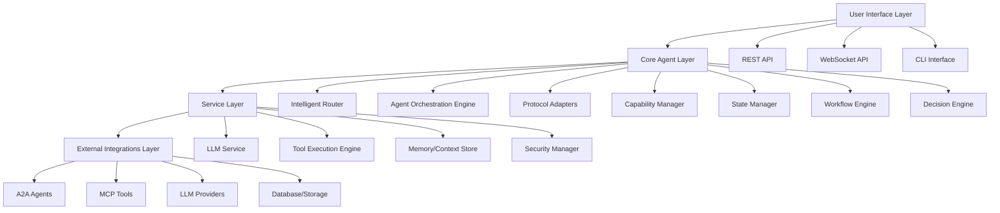

# OmniAgent Enhanced Architecture Design Document

## Overview

This design document outlines the technical architecture for transforming OmniAgent into a sophisticated, enterprise-grade platform with 4-layer architecture. The design builds upon the requirements document and provides detailed specifications for each component.

## Architecture Overview

OmniAgent's enhanced architecture adopts a clean 4-layer design pattern that provides clear separation of concerns, scalability, and maintainability. Each layer has specific responsibilities and communicates through well-defined interfaces.

### Layer Architecture Diagram



## Components and Interfaces

### 1. User Interface Layer

#### 1.1 REST API Design
- **Framework**: Axum (current implementation)
- **Endpoints**:
  - `GET /health` - Health check
  - `GET /info` - Agent information
  - `POST /chat` - Chat interface
  - `GET /capabilities` - Available capabilities
  - `POST /workflows` - Workflow execution
  - `GET /status` - Real-time status updates

#### 1.2 WebSocket API (Future)
- **Protocol**: JSON-based message protocol
- **Features**: Real-time updates, streaming responses, bidirectional communication

#### 1.3 CLI Interface (Future)
- **Framework**: clap.rs for argument parsing
- **Features**: Interactive mode, batch processing, configuration management

### 2. Core Agent Layer

#### 2.1 Intelligent Router
```rust
pub struct IntelligentRouter {
    decision_engine: Arc<DecisionEngine>,
    capability_manager: Arc<CapabilityManager>,
    state_manager: Arc<StateManager>,
}

impl IntelligentRouter {
    async fn route_request(&self, request: UserRequest) -> RouteDecision;
    async fn update_routing_rules(&self, rules: Vec<RoutingRule>);
}
```

#### 2.2 Agent Orchestration Engine
```rust
pub struct AgentOrchestrationEngine {
    active_agents: HashMap<String, Arc<dyn Agent>>,  
    workflow_manager: Arc<WorkflowManager>,
    state_manager: Arc<StateManager>,
}

impl AgentOrchestrationEngine {
    async fn orchestrate(&self, workflow: Workflow) -> OrchestrationResult;
    async fn manage_agent_lifecycle(&self, agent_id: String) -> LifecycleResult;
}
```

#### 2.3 Protocol Adapters
```rust
trait ProtocolAdapter {
    async fn send_request(&self, request: ProtocolRequest) -> ProtocolResponse;
    async fn handle_response(&self, response: ProtocolResponse) -> Result<(), Error>;
    fn get_capabilities(&self) -> Vec<Capability>;
}

struct A2AAdapter;
struct MCPAdapter;
struct CustomAdapter;
```

#### 2.4 Capability Manager
```rust
pub struct CapabilityManager {
    capabilities: Arc<RwLock<HashMap<String, Capability>>>,
    discovery_service: Arc<DiscoveryService>,
}

impl CapabilityManager {
    async fn discover_capabilities(&self) -> Vec<Capability>;
    async fn register_capability(&self, capability: Capability) -> Result<(), Error>;
    async fn select_capability(&self, criteria: CapabilityCriteria) -> Option<Capability>;
}
```

#### 2.5 State Manager
```rust
pub struct StateManager {
    short_term: Arc<RwLock<MemoryStore>>,
    medium_term: Arc<RwLock<MemoryStore>>,
    long_term: Arc<RwLock<MemoryStore>>,
    compression_service: Arc<CompressionService>,
}

impl StateManager {
    async fn store_state(&self, key: String, value: StateData, tier: MemoryTier);
    async fn retrieve_state(&self, key: String, tier: MemoryTier) -> Option<StateData>;
    async fn compress_context(&self, context: ContextData) -> CompressedContext;
}
```

#### 2.6 Workflow Engine
```rust
pub struct WorkflowEngine {
    workflow_store: Arc<RwLock<WorkflowStore>>,
    execution_service: Arc<ExecutionService>,
    state_manager: Arc<StateManager>,
}

impl WorkflowEngine {
    async fn create_workflow(&self, definition: WorkflowDefinition) -> WorkflowId;
    async fn execute_workflow(&self, id: WorkflowId) -> ExecutionResult;
    async fn monitor_workflow(&self, id: WorkflowId) -> WorkflowStatus;
}
```

#### 2.7 Decision Engine
```rust
pub struct DecisionEngine {
    decision_tree: Arc<RwLock<DecisionTree>>,
    ml_model: Arc<MLModel>,
    rules_engine: Arc<RulesEngine>,
}

impl DecisionEngine {
    async fn make_decision(&self, context: DecisionContext) -> Decision;
    async fn learn_from_outcome(&self, decision: Decision, outcome: Outcome);
}
```

### 3. Service Layer

#### 3.1 LLM Service
```rust
pub struct LLMService {
    providers: Arc<RwLock<HashMap<String, Box<dyn LLMProvider>>>>,
    model_manager: Arc<ModelManager>,
    rate_limiter: Arc<RateLimiter>,
}

impl LLMService {
    async fn process_message(&self, provider: String, message: Message) -> Result<Response, Error>;
    async fn switch_provider(&self, criteria: ProviderCriteria) -> Result<String, Error>;
    async fn get_provider_status(&self) -> HashMap<String, ProviderStatus>;
}
```

#### 3.2 Tool Execution Engine
```rust
pub struct ToolExecutionEngine {
    validator: Arc<ToolValidator>,
    executor: Arc<ToolExecutor>,
    scheduler: Arc<Scheduler>,
    security_manager: Arc<SecurityManager>,
}

impl ToolExecutionEngine {
    async fn validate_input(&self, input: ToolInput) -> ValidationResult;
    async fn execute_tool(&self, tool: Tool, parameters: Parameters) -> ExecutionResult;
    async fn schedule_execution(&self, requests: Vec<ToolRequest>) -> ScheduleResult;
}
```

#### 3.3 Memory/Context Store
```rust
pub struct MemoryStore {
    tier: MemoryTier,
    storage: Arc<dyn StorageBackend>,
    compression: Arc<CompressionService>,
}

impl MemoryStore {
    async fn store(&self, key: String, value: MemoryData) -> Result<(), Error>;
    async fn retrieve(&self, key: String) -> Option<MemoryData>;
    async fn compress(&self, data: MemoryData) -> CompressedData;
}
```

#### 3.4 Security Manager
```rust
pub struct SecurityManager {
    authenticator: Arc<Authenticator>,
    authorizer: Arc<Authorizer>,
    audit_logger: Arc<AuditLogger>,
}

impl SecurityManager {
    async fn authenticate(&self, credentials: Credentials) -> Result<User, Error>;
    async fn authorize(&self, user: User, action: Action, resource: Resource) -> Result<bool, Error>;
    async fn log_access(&self, event: SecurityEvent) -> Result<(), Error>;
}
```

### 4. External Integrations Layer

#### 4.1 A2A Integration
```rust
pub struct A2AIntegration {
    clients: Arc<RwLock<HashMap<String, A2AClient>>>,
    connection_pool: Arc<ConnectionPool>,
}

impl A2AIntegration {
    async fn register_agent(&self, config: A2AConfig) -> Result<(), Error>;
    async fn send_message(&self, agent_id: String, message: Message) -> Result<Response, Error>;
}
```

#### 4.2 MCP Integration
```rust
pub struct MCPIntegration {
    clients: Arc<RwLock<HashMap<String, MCPClient>>>,
    tool_registry: Arc<ToolRegistry>,
}

impl MCPIntegration {
    async fn register_server(&self, config: MCPConfig) -> Result<(), Error>;
    async fn execute_tool(&self, server_id: String, tool_name: String, parameters: Value) -> Result<Value, Error>;
}
```

## Data Models

### Core Data Structures

```rust
// User Request
pub struct UserRequest {
    pub id: Uuid,
    pub message: String,
    pub context: HashMap<String, Value>,
    pub priority: Priority,
    pub timeout: Duration,
}

// Route Decision
pub struct RouteDecision {
    pub target: RouteTarget,
    pub confidence: f32,
    pub reasoning: String,
    pub estimated_time: Duration,
}

// Workflow Definition
pub struct WorkflowDefinition {
    pub id: String,
    pub name: String,
    pub steps: Vec<WorkflowStep>,
    pub dependencies: Vec<Dependency>,
    pub timeout: Duration,
}

// Memory Data
pub struct MemoryData {
    pub key: String,
    pub value: Vec<u8>,
    pub metadata: MemoryMetadata,
    pub compression_level: CompressionLevel,
}

// Security Context
pub struct SecurityContext {
    pub user: Option<User>,
    pub permissions: Vec<Permission>,
    pub session: Option<Session>,
}
```

## Error Handling

### Error Types
- `RoutingError` - Issues with routing decisions
- `OrchestrationError` - Workflow management failures
- `MemoryError` - State management issues
- `SecurityError` - Authentication/authorization failures
- `IntegrationError` - External service communication failures

### Error Recovery Strategies
- **Retry with backoff** - For transient failures
- **Fallback providers** - Switch to alternative LLM providers
- **Graceful degradation** - Reduce functionality on failures
- **Circuit breaker** - Prevent cascading failures

## Testing Strategy

### Unit Tests
- Individual component functionality
- Error handling edge cases
- State transitions and workflows
- Router decision logic validation
- State manager buffer operations
- Capability manager registration and discovery
- LLM service token calculation and caching
- Memory service compression quality
- Tool execution engine lifecycle phases
- Protocol adapter capability matching
- Event system publishing and subscription

### Integration Tests
- Cross-layer communication
- External service integrations
- End-to-end workflow scenarios
- API endpoint functionality validation
- Conversation buffer specialized testing
- LLM provider management and switching
- A2A protocol message handling
- MCP protocol tool execution
- Security authentication and authorization
- Performance under concurrent load

### Performance Tests
- Memory usage under load
- Response time benchmarks
- Concurrent operation limits
- Buffer management efficiency
- Context compression/decompression performance
- Event processing throughput

### Security Tests
- Authentication bypass attempts
- Authorization edge cases
- Input validation vulnerabilities
- Password handling security
- Session management security
- Data encryption validation

## Implementation Phases

### Phase 1: Foundation (Weeks 1-3)
1. Refactor existing codebase to 4-layer architecture
2. Implement Core Agent Layer components
3. Migrate existing functionality
4. Add comprehensive testing

### Phase 2: Advanced Features (Weeks 4-6)
1. Implement event-driven coordination
2. Add advanced memory management
3. Enhance tool execution pipeline
4. Add performance optimizations

### Phase 3: Sophistication (Weeks 7-8)
1. Add recursive agent loop
2. Implement UI integration framework
3. Add comprehensive monitoring
4. Performance tuning and optimization

## Design Decisions and Rationale

1. **Axum Framework**: Chosen for async-first design, excellent performance, and strong ecosystem support
2. **Arc<RwLock<T>>**: Provides thread-safe shared access with read-write locks for concurrent operations
3. **Event-Driven Architecture**: Enables loose coupling between components and supports real-time updates
4. **4-Layer Architecture**: Provides clear separation of concerns and supports independent scaling
5. **Memory Tiers**: Optimizes for both performance and storage efficiency based on access patterns
6. **Protocol Adapters**: Enables easy integration with new protocols without core changes