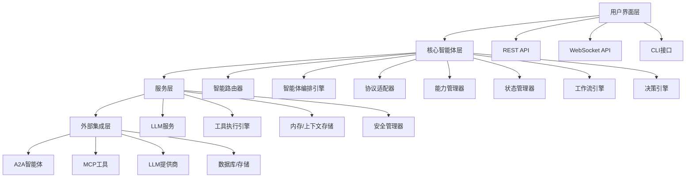

# OmniAgent 增强架构设计文档

## 概述

本设计文档概述了将OmniAgent转变为具备4层架构的复杂企业级平台的技术架构。该设计基于需求文档，为每个组件提供了详细规范。

## 架构概述

OmniAgent的增强架构采用清晰的4层设计模式，提供了清晰的关注点分离、可扩展性和可维护性。每一层都有特定的职责，并通过明确定义的接口进行通信。

### 分层架构图



## 组件和接口

### 1. 用户界面层

#### 1.1 REST API设计
- **框架**: Axum（当前实现）
- **端点**:
  - `GET /health` - 健康检查
  - `GET /info` - 智能体信息
  - `POST /chat` - 聊天接口
  - `GET /capabilities` - 可用能力
  - `POST /workflows` - 工作流执行
  - `GET /status` - 实时状态更新

#### 1.2 WebSocket API（未来）
- **协议**: 基于JSON的消息协议
- **特性**: 实时更新、流式响应、双向通信

#### 1.3 CLI接口（未来）
- **框架**: clap.rs用于参数解析
- **特性**: 交互模式、批处理、配置管理

### 2. 核心智能体层

#### 2.1 智能路由器
```rust
pub struct 智能路由器 {
    决策引擎: Arc<决策引擎>,
    能力管理器: Arc<能力管理器>,
    状态管理器: Arc<状态管理器>,
}

impl 智能路由器 {
    async fn 路由请求(&self, 请求: 用户请求) -> 路由决策;
    async fn 更新路由规则(&self, 规则: Vec<路由规则>);
}
```

#### 2.2 智能体编排引擎
```rust
pub struct 智能体编排引擎 {
    活跃智能体: HashMap<String, Arc<dyn 智能体>>,
    工作流管理器: Arc<工作流管理器>,
    状态管理器: Arc<状态管理器>,
}

impl 智能体编排引擎 {
    async fn 编排(&self, 工作流: 工作流) -> 编排结果;
    async fn 管理智能体生命周期(&self, 智能体id: String) -> 生命周期结果;
}
```

#### 2.3 协议适配器
```rust
trait 协议适配器 {
    async fn 发送请求(&self, 请求: 协议请求) -> 协议响应;
    async fn 处理响应(&self, 响应: 协议响应) -> Result<(), 错误>;
    fn 获取能力(&self) -> Vec<能力>;
}

struct A2A适配器;
struct MCP适配器;
struct 自定义适配器;
```

#### 2.4 能力管理器
```rust
pub struct 能力管理器 {
    能力: Arc<RwLock<HashMap<String, 能力>>>,
    发现服务: Arc<发现服务>,
}

impl 能力管理器 {
    async fn 发现能力(&self) -> Vec<能力>;
    async fn 注册能力(&self, 能力: 能力) -> Result<(), 错误>;
    async fn 选择能力(&self, 标准: 能力标准) -> Option<能力>;
}
```

#### 2.5 状态管理器
```rust
pub struct 状态管理器 {
    短期: Arc<RwLock<内存存储>>,
    中期: Arc<RwLock<内存存储>>,
    长期: Arc<RwLock<内存存储>>,
    压缩服务: Arc<压缩服务>,
}

impl 状态管理器 {
    async fn 存储状态(&self, 键: String, 值: 状态数据, 层级: 内存层级);
    async fn 检索状态(&self, 键: String, 层级: 内存层级) -> Option<状态数据>;
    async fn 压缩上下文(&self, 上下文: 上下文数据) -> 压缩上下文;
}
```

#### 2.6 工作流引擎
```rust
pub struct 工作流引擎 {
    工作流存储: Arc<RwLock<工作流存储>>,
    执行服务: Arc<执行服务>,
    状态管理器: Arc<状态管理器>,
}

impl 工作流引擎 {
    async fn 创建工作流(&self, 定义: 工作流定义) -> 工作流Id;
    async fn 执行工作流(&self, id: 工作流Id) -> 执行结果;
    async fn 监控工作流(&self, id: 工作流Id) -> 工作流状态;
}
```

#### 2.7 决策引擎
```rust
pub struct 决策引擎 {
    决策树: Arc<RwLock<决策树>>,
    机器学习模型: Arc<ML模型>,
    规则引擎: Arc<规则引擎>,
}

impl 决策引擎 {
    async fn 做决策(&self, 上下文: 决策上下文) -> 决策;
    async fn 从结果学习(&self, 决策: 决策, 结果: 结果);
}
```

### 3. 服务层

#### 3.1 LLM服务
```rust
pub struct LLM服务 {
    提供商: Arc<RwLock<HashMap<String, Box<dyn LLM提供商>>>>,
    模型管理器: Arc<模型管理器>,
    速率限制器: Arc<速率限制器>,
}

impl LLM服务 {
    async fn 处理消息(&self, 提供商: String, 消息: 消息) -> Result<响应, 错误>;
    async fn 切换提供商(&self, 标准: 提供商标准) -> Result<String, 错误>;
    async fn 获取提供商状态(&self) -> HashMap<String, 提供商状态>;
}
```

#### 3.2 工具执行引擎
```rust
pub struct 工具执行引擎 {
    验证器: Arc<工具验证器>,
    执行器: Arc<工具执行器>,
    调度器: Arc<调度器>,
    安全管理器: Arc<安全管理器>,
}

impl 工具执行引擎 {
    async fn 验证输入(&self, 输入: 工具输入) -> 验证结果;
    async fn 执行工具(&self, 工具: 工具, 参数: 参数) -> 执行结果;
    async fn 调度执行(&self, 请求: Vec<工具请求>) -> 调度结果;
}
```

#### 3.3 内存/上下文存储
```rust
pub struct 内存存储 {
    层级: 内存层级,
    存储: Arc<dyn 存储后端>,
    压缩: Arc<压缩服务>,
}

impl 内存存储 {
    async fn 存储(&self, 键: String, 值: 内存数据) -> Result<(), 错误>;
    async fn 检索(&self, 键: String) -> Option<内存数据>;
    async fn 压缩(&self, 数据: 内存数据) -> 压缩数据;
}
```

#### 3.4 安全管理器
```rust
pub struct 安全管理器 {
    认证器: Arc<认证器>,
    授权器: Arc<授权器>,
    审计日志器: Arc<审计日志器>,
}

impl 安全管理器 {
    async fn 认证(&self, 凭据: 凭据) -> Result<用户, 错误>;
    async fn 授权(&self, 用户: 用户, 操作: 操作, 资源: 资源) -> Result<bool, 错误>;
    async fn 记录访问(&self, 事件: 安全事件) -> Result<(), 错误>;
}
```

### 4. 外部集成层

#### 4.1 A2A集成
```rust
pub struct A2A集成 {
    客户端: Arc<RwLock<HashMap<String, A2A客户端>>>,
    连接池: Arc<连接池>,
}

impl A2A集成 {
    async fn 注册智能体(&self, 配置: A2A配置) -> Result<(), 错误>;
    async fn 发送消息(&self, 智能体id: String, 消息: 消息) -> Result<响应, 错误>;
}
```

#### 4.2 MCP集成
```rust
pub struct MCP集成 {
    客户端: Arc<RwLock<HashMap<String, MCP客户端>>>,
    工具注册表: Arc<工具注册表>,
}

impl MCP集成 {
    async fn 注册服务器(&self, 配置: MCP配置) -> Result<(), 错误>;
    async fn 执行工具(&self, 服务器id: String, 工具名称: String, 参数: 值) -> Result<值, 错误>;
}
```

## 数据模型

### 核心数据结构

```rust
// 用户请求
pub struct 用户请求 {
    pub id: Uuid,
    pub 消息: String,
    pub 上下文: HashMap<String, 值>,
    pub 优先级: 优先级,
    pub 超时: Duration,
}

// 路由决策
pub struct 路由决策 {
    pub 目标: 路由目标,
    pub 置信度: f32,
    pub 推理: String,
    pub 估计时间: Duration,
}

// 工作流定义
pub struct 工作流定义 {
    pub id: String,
    pub 名称: String,
    pub 步骤: Vec<工作流步骤>,
    pub 依赖: Vec<依赖>,
    pub 超时: Duration,
}

// 内存数据
pub struct 内存数据 {
    pub 键: String,
    pub 值: Vec<u8>,
    pub 元数据: 内存元数据,
    pub 压缩级别: 压缩级别,
}

// 安全上下文
pub struct 安全上下文 {
    pub 用户: Option<用户>,
    pub 权限: Vec<权限>,
    pub 会话: Option<会话>,
}
```

## 错误处理

### 错误类型
- `路由错误` - 路由决策问题
- `编排错误` - 工作流管理失败
- `内存错误` - 状态管理问题
- `安全错误` - 认证/授权失败
- `集成错误` - 外部服务通信失败

### 错误恢复策略
- **带退避的重试** - 用于瞬态故障
- **回退提供商** - 切换到替代LLM提供商
- **优雅降级** - 故障时减少功能
- **熔断器** - 防止级联故障

## 测试策略

### 单元测试
- 单个组件功能
- 错误处理边缘情况
- 状态转换和工作流

### 集成测试
- 跨层通信
- 外部服务集成
- 端到端工作流场景

### 性能测试
- 负载下的内存使用
- 响应时间基准
- 并发操作限制

### 安全测试
- 认证绕过尝试
- 授权边缘情况
- 输入验证漏洞

## 实施阶段

### 第1阶段：基础（第1-3周）
1. 将现有代码库重构为4层架构
2. 实现核心智能体层组件
3. 迁移现有功能
4. 添加全面测试

### 第2阶段：高级功能（第4-6周）
1. 实现事件驱动协调
2. 添加高级内存管理
3. 增强工具执行管道
4. 添加性能优化

### 第3阶段：复杂化（第7-8周）
1. 添加递归智能体循环
2. 实现UI集成框架
3. 添加全面监控
4. 性能调优和优化

## 设计决策和原理

1. **Axum框架**: 选择其异步优先设计、卓越性能和强大的生态系统支持
2. **Arc<RwLock<T>>**: 为并发操作提供线程安全的共享访问和读写锁
3. **事件驱动架构**: 实现组件间松耦合，支持实时更新
4. **4层架构**: 提供清晰的关注点分离，支持独立扩展
5. **内存层级**: 根据访问模式优化性能和存储效率
6. **协议适配器**: 无需核心更改即可轻松集成新协议